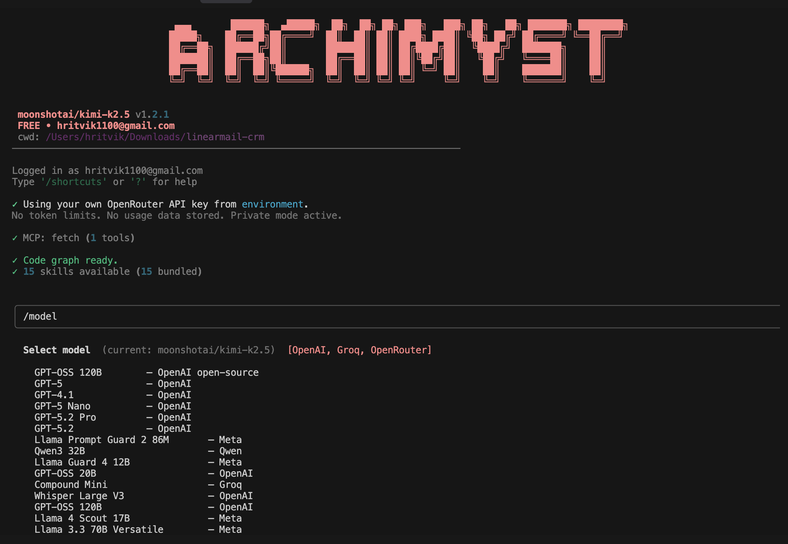

```
 ▄▄▄       ██████╗  ▄█████╗  ██╗  ██╗ ██╗ ███╗   ███╗ ██╗   ██╗ ███████╗ ████████╗
 █████╗    ██╔══██╗██╔════╝  ██║  ██║ ██║ ████╗ ████║ ╚██╗ ██╔╝ ██╔════╝ ╚══██╔══╝
 ██╔══██╗  ██████╔╝██║       ███████║ ██║ ██╔████╔██║  ╚████╔╝  ███████╗    ██║   
 ███████║  ██╔══██╗██║       ██╔══██║ ██║ ██║╚██╔╝██║   ╚██╔╝   ╚════██║    ██║   
 ██╔══██║  ██║  ██║╚██████╗  ██║  ██║ ██║ ██║ ╚═╝ ██║    ██║    ███████║    ██║   
 ╚═╝  ╚═╝  ╚═╝  ╚═╝ ╚═════╝  ╚═╝  ╚═╝ ╚═╝ ╚═╝     ╚═╝    ╚═╝    ╚══════╝    ╚═╝   
```
[](https://github.com/hritvikgupta/Archimyst)
[](LICENSE)
[](https://www.python.org/)


ArchCode Terminal is a professional-grade AI CLI designed for instant understanding and coordinated modifications across million-line codebases. It orchestrates a Council of Agents powered by world-class LLMs, high-fidelity symbol indexing, and a versatile Skill system.

[Documentation](https://www.archimyst.com/documentation) • [Installation](https://www.archimyst.com/documentation/installation) • [Quick Start](https://www.archimyst.com/documentation/quickstart) • [API Reference](https://www.archimyst.com/documentation/api)

---
<p align="center">
  
</p>

## Installation

Get ArchCode up and running in seconds with our one-liner installer:

```bash
curl -fsSL https://www.archimyst.com/install.sh | bash
```

This script detects your OS/Architecture, installs dependencies like `ripgrep`, sets up the environment, and adds `archcode` to your PATH.

### Manual Installation

```bash
git clone https://github.com/hritvikgupta/Archimyst
cd Archimyst/backend/archcode-terminal
pip install -r requirements.txt
python -m archcode-cli
```

### System Requirements

- Python 3.10 or higher
- 4GB RAM minimum (8GB recommended)
- ripgrep (rg) for fast text search
- 500MB disk space for vector storage

---

## Key Features

### Council of Agents
Specialized agents working together to solve complex tasks:
- **Supervisor Agent**: Orchestrates workflow and delegates tasks
- **Coder Agent**: Generates and modifies code with surgical precision
- **Reviewer Agent**: Validates changes and ensures code quality
- **Executor Agent**: Runs commands and manages the terminal environment

### Deep Code Indexing
High-fidelity AST parsing using `tree-sitter` and semantic search with `voyage-code-3` embeddings. Understand your codebase instantly without reading every file.

### Extensible Skills
Native support for Model Context Protocol (MCP) and a modular Skill Manager to extend functionality. Deploy microservices, manage infrastructure, and automate workflows with pre-built skills.

### Private Mode
Use your own API keys (OpenRouter/OpenAI/Anthropic) for zero token limits and maximum privacy. No usage data is stored.

### Performance First
Local vector storage with `Qdrant` (in-memory persistent mode) for lightning-fast retrieval without Docker overhead.

---

## Agent Capabilities

ArchCode's agents are designed to handle complex software engineering tasks:

### Debugging & Error Resolution
- Automatic error detection and root cause analysis
- Stack trace parsing and symbol resolution
- Suggest and apply fixes for runtime and compile-time errors
- Integration with testing frameworks for verification

### Code Refactoring
- Large-scale refactoring across multiple files
- Rename symbols with confidence using impact analysis
- Extract functions, classes, and modules
- Modernize legacy code patterns

### Feature Implementation
- End-to-end feature development from requirements
- API design and implementation
- Database schema migrations
- Frontend component creation

### Code Review & Quality
- Automated code review with best practice suggestions
- Security vulnerability detection
- Performance bottleneck identification
- Style guide enforcement

### Testing & Verification
- Generate unit, integration, and E2E tests
- Achieve coverage targets
- Mock external dependencies
- CI/CD pipeline integration

---

## 50% Less Token Consumption

ArchCode is engineered for efficiency:

- **Intelligent Context Pruning**: Only sends relevant code symbols to the LLM, reducing noise
- **Semantic Search Pre-filtering**: Finds exactly what you need before invoking expensive models
- **Hierarchical Summarization**: Compresses large files into concise representations
- **Caching Layer**: Reuses previous analysis results for repeated queries
- **Smart Chunking**: Breaks large files into optimal-sized pieces for processing

Compared to generic AI coding assistants, ArchCode consumes up to **50% fewer tokens** while delivering more accurate, context-aware results.

---

## Configuration

ArchCode is flexible. You can use our managed backend or bring your own keys.

### Environment Variables

Add your keys to your `.env` file in the project root:

```env
# Primary AI Provider (OpenRouter recommended for 200+ models)
OPENROUTER_API_KEY=sk-or-...

# Semantic Search (Required for deep indexing)
VOYAGE_API_KEY=your_voyage_key_here

# Optional Direct Providers
OPENAI_API_KEY=sk-...
ANTHROPIC_API_KEY=sk-ant-...
TAVILY_API_KEY=tvly-...
```

### In-CLI Configuration

Manage your setup directly from the terminal:
- `/login`: Sync with your Archimyst account
- `/config`: Open interactive configuration manager
- `/model`: Switch between optimized models on the fly

---

## Usage Guide

After installation, simply run:

```bash
archcode
```

### Core Commands

| Command | Description |
|---------|-------------|
| `/index` | Recursively index the current directory for semantic search |
| `/search <query>` | Find code symbols using natural language |
| `/context <symbol>` | Get 360-degree view of any symbol |
| `/impact <symbol>` | Analyze blast radius before making changes |
| `/connect` | Install new skills or MCP servers |
| `/reset` | Clear the current session history and context |
| `/help` | Show all available commands and agents |

### Example Interaction

```
User: Explain how the authentication flow works in the backend.

Supervisor: Coordinating with Coder agent to analyze authentication flow...

Coder: Found AuthMiddleware.authenticate in src/auth/middleware.py:45
        Analyzing dependencies...
        
        Flow: login() -> validate_credentials() -> generate_token() -> set_cookie()
        
        Key files:
        - src/auth/middleware.py: Entry point
        - src/auth/service.py: Business logic
        - src/auth/jwt.py: Token generation
```

---

## Architecture

| Component | Technology | Purpose |
|-----------|------------|---------|
| Embeddings | voyage-code-3 | Optimized for code understanding |
| Symbol Extraction | tree-sitter | High-fidelity parsing of Python, JS, TS, TSX, Go, and more |
| Vector Engine | Qdrant | Fast similarity search with local persistence |
| Agent Framework | Custom orchestration | Low-latency multi-agent collaboration |
| CLI Interface | prompt-toolkit + rich | Professional terminal experience |

---

## Documentation

Comprehensive documentation is available at [archimyst.com/documentation](https://www.archimyst.com/documentation):

- [Installation Guide](https://www.archimyst.com/documentation/installation)
- [Quick Start Tutorial](https://www.archimyst.com/documentation/quickstart)
- [Command Reference](https://www.archimyst.com/documentation/commands)
- [Agent System](https://www.archimyst.com/documentation/agents)
- [Skills & MCP](https://www.archimyst.com/documentation/skills)
- [Troubleshooting](https://www.archimyst.com/documentation/troubleshooting)

---

## Contributing

We welcome contributions. To get started:

1. Clone the repo: `git clone https://github.com/hritvikgupta/Archimyst`
2. Setup Venv: `python3 -m venv venv && source venv/bin/activate`
3. Install Deps: `pip install -r requirements.txt`
4. Run Tests: `pytest backend/archcode-terminal/archcode-cli/`

Please read our [Contribution Guidelines](CONTRIBUTING.md) for more details.

---

## Code of Conduct

Please read our [Code of Conduct](CODE_OF_CONDUCT.md) to understand the standards we expect from our community.

## Security

If you discover a security vulnerability, please follow our [Security Policy](SECURITY.md) for responsible disclosure.

## License

This project is licensed under the MIT License. See the [LICENSE](LICENSE) file for details.

Built by the Archimyst team.
